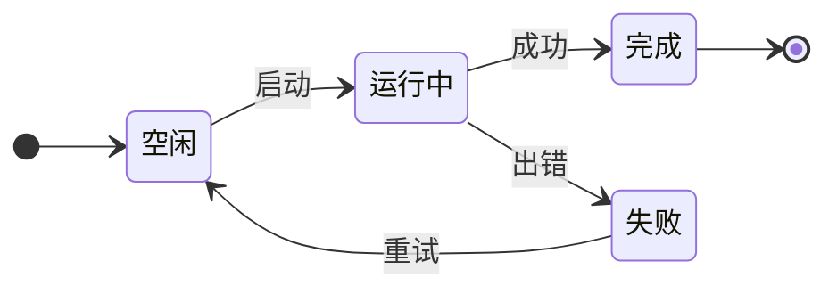
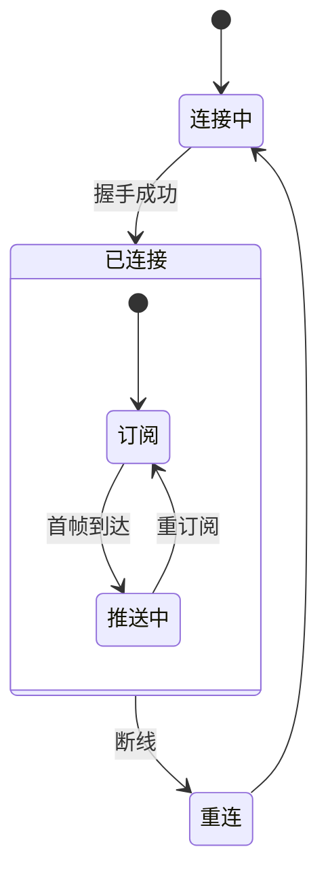
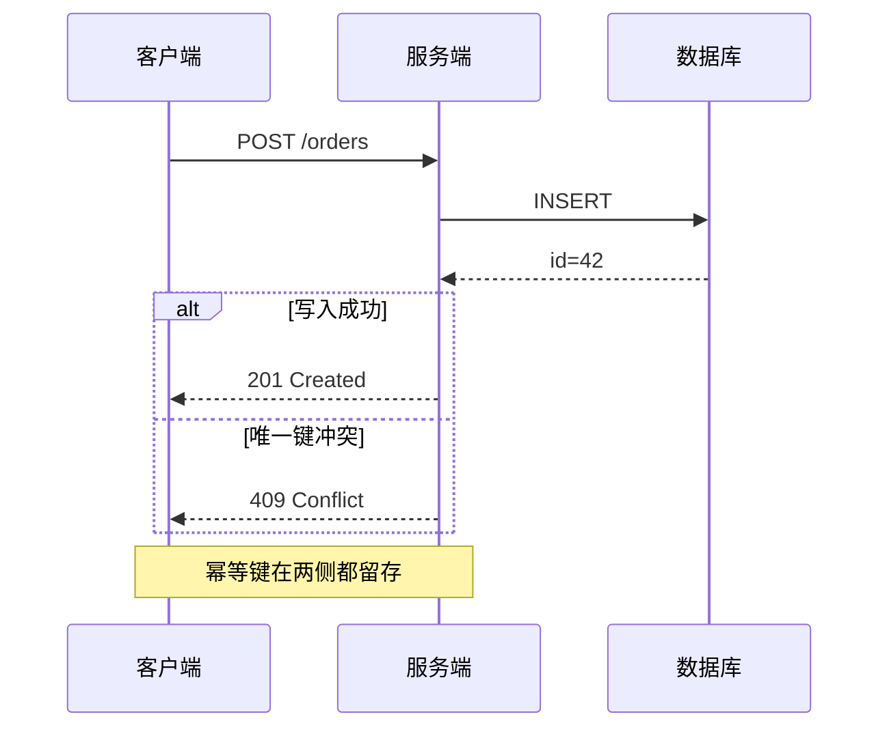
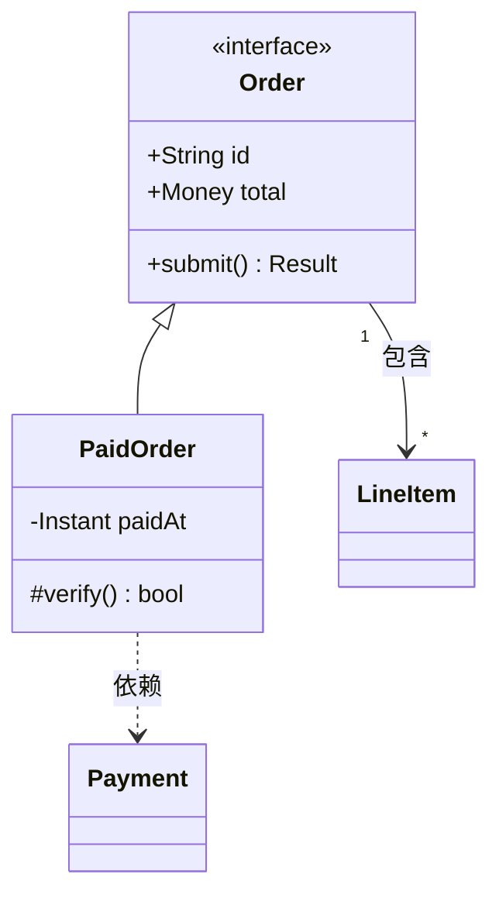
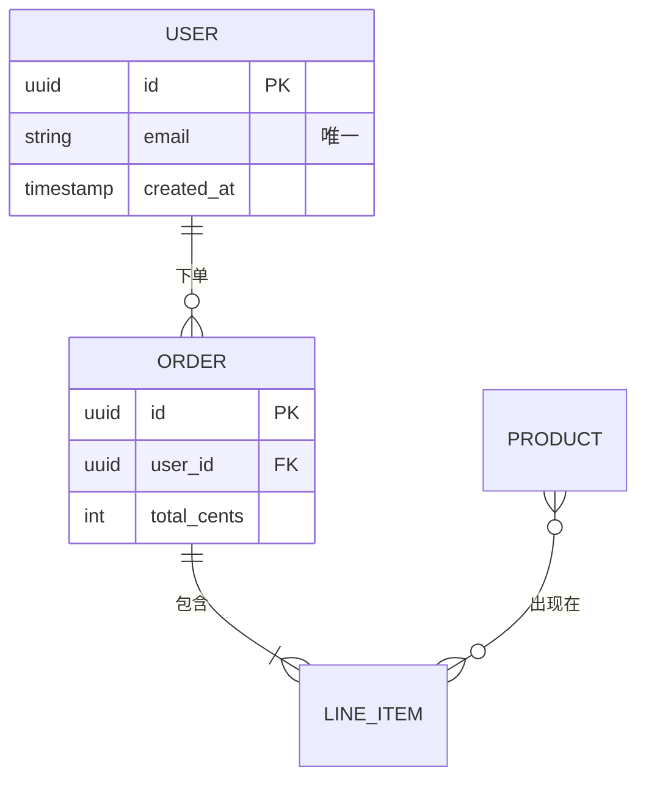

# openchamber-mermaid

Open Chamber 认的 Mermaid 是官方语法的一个子集。**照官方 Mermaid 文档写会踩坑，照这份写。**

## 五条硬规则

**一、只能用这 6 类图**：flowchart、stateDiagram、sequenceDiagram、classDiagram、erDiagram、xychart-beta。

其余一律不能用：`pie`、`gantt`、`mindmap`、`gitGraph`、`journey`、`timeline`、`C4Context`、`quadrantChart`、`block-beta`、`architecture-beta`、`sankey`、`packet`、`kanban`、`radar`、`treemap`。要画饼图或甘特图，换成表格或 xychart-beta。

**二、禁止写 `%%{init: {...}}%%`，禁止写 YAML frontmatter。** 前者无效，后者让整张图渲染失败。配色走 `classDef` + CSS 变量。

**三、语法要一次写对。** 渲染失败没有报错，用户看到的是一段没格式的源码。

**四、每张 flowchart 结尾必须补上这三行。** 渲染器默认的线又细又淡，这三行把线提到 2px 粗、`var(--muted)` 亮：

```
classDef base stroke:var(--muted),stroke-width:2px
class 节点1,节点2,节点3 base
linkStyle default stroke:var(--muted),stroke-width:2px
```

节点 ID 要逐个列进 `class` 行，`classDef default` 无效，没有「全体节点」的简写。已经挂了带颜色 classDef 的节点无须再挂 `base`，把 `stroke:var(--muted),stroke-width:2px` 写进那个 classDef 即可。

另外五类图没有任何样式入口，它们的线宽与线色写死在渲染器里，图里写什么都改不动。**线条可读性重要时，把内容改用 flowchart 表达** —— 那是唯一能调线的一类，时序内容的画法见「时序内容改画 flowchart」一节。

**五、`%%` 注释禁止放在首行之前。** 类型判定读原始首行，注释顶掉 header 会让 sequenceDiagram、classDiagram、erDiagram、xychart 四类整张图渲染失败。注释放在首行之后。

## 首行

| 图类型 | 首行必须写成 |
|---|---|
| 流程图 | `flowchart LR`（方向可换 `TD` `TB` `BT` `RL`）|
| 状态机 | `stateDiagram-v2` |
| 时序图 | `sequenceDiagram`，单独一行，后面不跟任何内容 |
| 类图 | `classDiagram`，单独一行 |
| ER 图 | `erDiagram`，单独一行 |
| 图表 | `xychart-beta`，横向加 `xychart-beta horizontal` |

- `flowchart` 和 `graph` 必须带方向，裸写会失败
- 首行结尾禁止加分号

## flowchart

```mermaid
flowchart LR
  in[请求] --> guard{有权限?}
  guard -->|是| work[执行]
  guard -->|否| deny[[拒绝]]
  work --> db[(数据库)]
  work --> out((完成))

  classDef base stroke:var(--muted),stroke-width:2px
  classDef hot fill:var(--surface),stroke:var(--accent),stroke-width:2px
  classDef dim fill:var(--bg),stroke:var(--muted),color:var(--muted),stroke-width:2px
  class in,work,db,out base
  class guard hot
  class deny dim
  linkStyle default stroke:var(--muted),stroke-width:2px
```

底座三行照硬规则四写，示例里已经带上。`%%` 注释在 flowchart 里放哪都安全，其余四类只能放在首行之后。

### 节点形状

| 写法 | 形状 | 写法 | 形状 |
|---|---|---|---|
| `A[文字]` | 矩形 | `A((文字))` | 圆形 |
| `A(文字)` | 圆角矩形 | `A(((文字)))` | 双圈 |
| `A([文字])` | 体育场 | `A>文字]` | 不对称旗标 |
| `A[[文字]]` | 子程序 | `A{文字}` | 菱形（判断） |
| `A[(文字)]` | 圆柱（数据库） | `A{{文字}}` | 六边形 |
| `A[/文字/]` | 平行四边形 | `A[/文字\]` | 梯形 |
| `A[\文字/]` | 倒梯形 | `A[\文字\]` | 反平行四边形 |

### 边

只用这九种：

```
A --> B          实线箭头
A --- B          实线无箭头
A -.-> B         虚线箭头
A -.- B          虚线无箭头
A ==> B          粗线箭头
A === B          粗线无箭头
A <--> B         双向实线
A <-.-> B        双向虚线
A <==> B         双向粗线
```

> ⚠️ **禁止 `-->>`、`--o`、`--x`、`o--o`、`x--x`。** 这几种会让**目标节点整个消失**，图上只剩源节点，无任何提示。

带标签：`A -->|标签| B`、`A -- 标签 --> B`、`A -. 标签 .-> B`、`A == 标签 ==> B`。

链式和分叉：`A --> B --> C`、`A --> B & C`、`A & B --> C & D`。

`==>` 自带 2 的线宽，留给需要强调的那一两条边，全图统一加粗用 `linkStyle default`。

### 标签

节点 ID 可用字母、数字、下划线、连字符、点、中文。标签可含中文、emoji、逗号、括号、冒号，含空格或标点时用双引号包：`A["取消, 并回滚 (可撤销)"]`。

**超过 12 个字用 `<br/>` 断行。** 没有自动换行，长标签会把整张图拉变形。

```mermaid
flowchart LR
  A["第一行文字<br/>第二行文字"] --> B[短标签]

  classDef base stroke:var(--muted),stroke-width:2px
  class A,B base
  linkStyle default stroke:var(--muted),stroke-width:2px
```

### 子图

```mermaid
flowchart TB
  subgraph edge[边缘层]
    direction LR
    cdn[CDN] --> lb[负载均衡]
  end
  subgraph core[核心层]
    direction LR
    api[API] --> cache[(缓存)]
  end
  lb --> api

  classDef base stroke:var(--muted),stroke-width:2px
  class cdn,lb,api,cache base
  linkStyle default stroke:var(--muted),stroke-width:2px
```

标题三种写法：`subgraph S`、`subgraph S1[显示名]`、`subgraph "带空格的名字"`。支持嵌套和内层独立 `direction`。

`%%` 开头的注释行会被剥掉，可以放心写。

## stateDiagram-v2





**能用**：`[*]` 起止点、`A --> B: 标签`、`direction`、复合状态 `state S { ... }`、别名 `state "长描述" as S`、`state f <<fork>>`、`state c <<choice>>`、并发分隔符 `--`。

**禁止**：任何 `classDef` / `class` / `style` —— 状态图没有配色入口。尤其禁止 `A:::类名`，它会在图上画出一段 `::类名` 的垃圾文字。

`note right of X:` 无效，注解写进状态名里。

## sequenceDiagram



**箭头只有四种样子**，请求用 `->>`，响应用 `-->>`：

| 写法 | 渲染成 |
|---|---|
| `->>` 和 `-x` | 实线 + 箭头 |
| `-->>` 和 `--x` | 虚线 + 箭头 |
| `->` 和 `-)` | 实线，无箭头 |
| `-->` 和 `--)` | 虚线，无箭头 |

`-x`（消息丢失）和 `-)`（异步）的语义画不出来，需要表达就写进消息文字里。

**能用**：`participant X as 别名`、`actor X`、`Note over A,B: 文字`、`Note right of X:`、`note left of X:`、`loop`、`alt` / `else`、`opt`、`par` / `and`、`critical` / `option`、`break`、`rect`。参与者名字可以是中文。

**激活条用 `+` / `-` 简写画**，写在接收方前面：`A->>+B: 请求`、`B-->>-A: 应答`。支持嵌套。独立成行的 `activate B` / `deactivate B` 语句无效。

**无效**：`autonumber`、独立行的 `activate` / `deactivate`、`box`，以及一切 `classDef` / `style` / `linkStyle`。

**线的粗细在这一类里完全固定**（消息线 1、生命线 0.75），图源里没有任何入口。线色和箭头色由 Open Chamber 主题统一决定，图源同样够不着。需要控制线条粗细、单独强调某条消息、或者参与方与分支一多就读不清时，改用下一节的泳道式 flowchart。

**参与者一律写 `participant X as 名字`**，裸写 `participant A` 等于没写。

## 时序内容改画 flowchart

时序图的线细且不可调。**参与方多、或者线条可读性重要时，把时序内容画成泳道式 flowchart** —— 一个参与方一个 `subgraph`，步骤按时间顺序编号，一条直链穿过泳道。

```mermaid
flowchart LR
  subgraph USER[用户]
    U1["① 提交"]
    U5["⑤ 收到应答"]
  end
  subgraph API[服务端]
    A2["② 校验"]
    A4["④ 组装应答"]
  end
  subgraph DB[数据库]
    D3["③ 写入"]
  end

  U1 --> A2 --> D3 --> A4 --> U5

  classDef base stroke:var(--muted),stroke-width:2px
  class U1,U5,A2,A4,D3 base
  linkStyle default stroke:var(--muted),stroke-width:2px
```

写法要点：

- **必须是一条直链**，`A --> B --> C --> D` 串到底。这是这个画法成立的前提
- **每个参与方一个 `subgraph`**，框名就是参与方名字，身份靠框表达
- **步骤编号 ① ② ③ 写在标签开头**，顺序靠编号而非靠位置，跨泳道时读者不会跟丢
- **节点 ID 带参与方前缀**（`U1` `A2` `D3`），一眼看出这一步归谁
- **底座三行照写**，`linkStyle default stroke-width:2px` 单写只给粗细，线色仍是淡的，两个属性都要给
- 参与方 3 个以内用 `LR`（横向铺开），再多改 `TD`（纵向，泳道堆叠）

### 泳道里禁止画分支

菱形判断加两条出边会让线在泳道之间来回穿，画面立刻变乱 —— 实测同样内容，直链 4 条边 16 个折点，加一个菱形分支变成 5 条边 20 个折点、画布高出近一倍。

有分支时三选一：

1. **只画主路径**，异常分支写进步骤标签：`③ 写入新单（幂等键重复则返回既有单）`
2. **两条路径各画一张图**，标题说明各自的前提
3. **放弃泳道，改用普通 flowchart** —— 分支多的内容本来就更适合决策树的形状，此时参与方写进节点标签即可

```mermaid
flowchart LR
  a["① 客户端<br/>发起下单"] --> b{"② 服务端<br/>幂等键见过吗?"}
  b -->|没见过| c["③ 写库<br/>返回 201"]
  b -->|见过| d["④ 返回既有单<br/>409"]

  classDef base stroke:var(--muted),stroke-width:2px
  classDef hot fill:var(--surface),stroke:var(--accent),stroke-width:2px
  class a,c,d base
  class b hot
  linkStyle default stroke:var(--muted),stroke-width:2px
```

**什么时候仍用 `sequenceDiagram`**：往返简单、参与方两三个，线细也读得动的时候。用户点名要时序图时也照画。

## classDiagram



**关系线**：`<|--` 继承、`*--` 组合、`o--` 聚合、`-->` 关联、`..>` 依赖、`..|>` 实现、`<..`、`--|>`、`--*`、`--o`、`<|..`。`-->` 和 `--` 同形。

**能用**：类体 `{ }`、成员 `+String id`、方法 `+run() void`、可见性 `+ - # ~`、`<<interface>>` / `<<enumeration>>`、泛型 `class Box~T~`、基数 `"1" --> "*"`、关系标签 `: 文字`、单行成员 `A : +int age`。

**无效**：`namespace`、`note`、任何 `classDef`。

## erDiagram



基数两端各四选一 —— 左端 `||` 恰好一、`|o` 零或一、`}o` 零或多、`}|` 一或多，右端镜像成 `||`、`o|`、`o{`、`|{`。中间 `--` 实线（识别关系）、`..` 虚线（非识别关系）。`}o--o{` 和 `}o--||` 同形。

**能用**：属性块（类型 + 名字）、`PK` / `FK` 标记、属性后的双引号注释、带空格的实体名（双引号包）。

**无效**：任何 `classDef`。

## xychart-beta

```mermaid
xychart-beta
  title "每周成交量"
  x-axis [周一, 周二, 周三, 周四, 周五]
  y-axis "笔数" 0 --> 500
  bar [120, 310, 250, 480, 390]
  line [150, 280, 300, 420, 400]
```

**能用**：`title`、分类轴 `x-axis [a, b, c]`、数值轴 `x-axis 1 --> 10`、`y-axis "标题" 下限 --> 上限`、`bar`、`line`、多组 `bar` 或 `line` 叠加。`title` 和 `y-axis` 可省略，分类名含空格时用双引号。

**无效**：任何 `classDef`。

## 配色

七个主题变量，写进 `classDef` 会原样进 SVG，跟着 Open Chamber 主题走：

| 变量 | 用来画 |
|---|---|
| `var(--muted)` | **线和边框的默认色**，节点次要文字 |
| `var(--accent)` | 关键路径、要强调的描边 |
| `var(--fg)` | 文字，以及需要最强反差的线 |
| `var(--surface)` | 强调节点的底色 |
| `var(--bg)` | 弱化节点的底色 |
| `var(--border)`、`var(--line)` | 渲染器给线用的默认色，主题会决定它有多亮 |

```mermaid
flowchart LR
  a[普通] --> b[强调]:::hot --> c[弱化]:::dim

  classDef base stroke:var(--muted),stroke-width:2px
  classDef hot fill:var(--surface),stroke:var(--accent),stroke-width:2px,color:var(--fg)
  classDef dim fill:var(--bg),stroke:var(--muted),color:var(--muted),stroke-width:2px
  class a base
  linkStyle default stroke:var(--muted),stroke-width:2px
```

**规则：**

- **颜色值里禁止出现逗号。** `color-mix(in srgb, ...)` 和 `rgba(1,2,3,.4)` 会被切碎成无效属性。只写 `var(--x)`、`#hex` 或颜色名。
- **`classDef` 只认四个属性**：`fill`、`stroke`、`stroke-width`、`color`。`stroke-dasharray`、`opacity`、`rx`、`font-weight`、`font-size`、`font-family`、`text-decoration` 全部丢弃。要表达「虚线」改用虚线连边 `-.->` 或换节点形状。
- **`classDef default` 无效**，节点 ID 要逐个列。
- 写死十六进制会在切换亮暗主题时失配，只在颜色本身携带语义时用（例如交通灯）。
- 一张图最多三个 `classDef`：正常、强调、弱化。

**五条配色语句只在 flowchart 里生效**，其余五类图零配色入口：

| 语句 | 写法 |
|---|---|
| 定义样式类 | `classDef 名 属性` |
| 挂到节点 | `class A,B 名` |
| 挂到节点（内联） | `A:::名` 或 `A[标签]:::名` |
| 单节点直接改 | `style A fill:...` |
| 改连线 | `linkStyle 0 stroke:...`，`linkStyle 0,2,3 ...` 改多条，`linkStyle default ...` 改全部 |

`linkStyle` 的序号按边在源码里出现的顺序从 0 数。

用户可能把渲染切成 ASCII 模式，那时颜色全部丢失 —— 图的意思要靠结构和文字站住，配色只做锦上添花。

## 禁写清单

写了不报错、也不生效，最难自查：

| 语句 | 所在图 |
|---|---|
| `%%{init: {...}}%%` | 全部 |
| `classDef default` | flowchart |
| `class X 类名`、`style X ...`、`A:::类名` | stateDiagram |
| `note right of X` | stateDiagram |
| `autonumber` | sequenceDiagram |
| 独立行的 `activate` / `deactivate`（改用 `->>+` / `-->>-` 简写） | sequenceDiagram |
| `box ... end` | sequenceDiagram |
| `namespace`、`note` | classDiagram |
| 任何 `classDef` / `style` / `linkStyle` | flowchart 之外的五类 |
| 裸 `participant A`（不带 `as`） | sequenceDiagram |

**让整张图变纯文本**：YAML frontmatter、裸 `graph` / `flowchart`、首行带分号、6 类之外的图类型、`%%` 注释放在首行之前（flowchart 和 stateDiagram 除外）。

**吞掉目标节点**：flowchart 里的 `-->>`、`--o`、`--x`、`o--o`、`x--x`。

**画出垃圾文字**：stateDiagram 里的 `A:::类名`。

## 选型与排版

**选类型**：讲「东西怎么流动」用 flowchart；讲「谁在什么时刻对谁说了什么」用 sequenceDiagram，参与方多或分支多就改用泳道式 flowchart；讲「一个东西有哪几种状态、怎么转」用 stateDiagram-v2；讲「数据长什么样」用 erDiagram 或 classDiagram；讲数字用 xychart-beta。

**控制规模**：超过 15 个节点在对话气泡里会缩得读不清，拆成两张或用 subgraph 压层次。

**选方向**：线性流程用 `LR`，有分支的决策树用 `TD`。

**标签短**，超过 12 个字用 `<br/>` 断行。

---

渲染器的实现细节、每条结论的实测数据、以及重新验证的方法，见同目录的 `README.md`。
